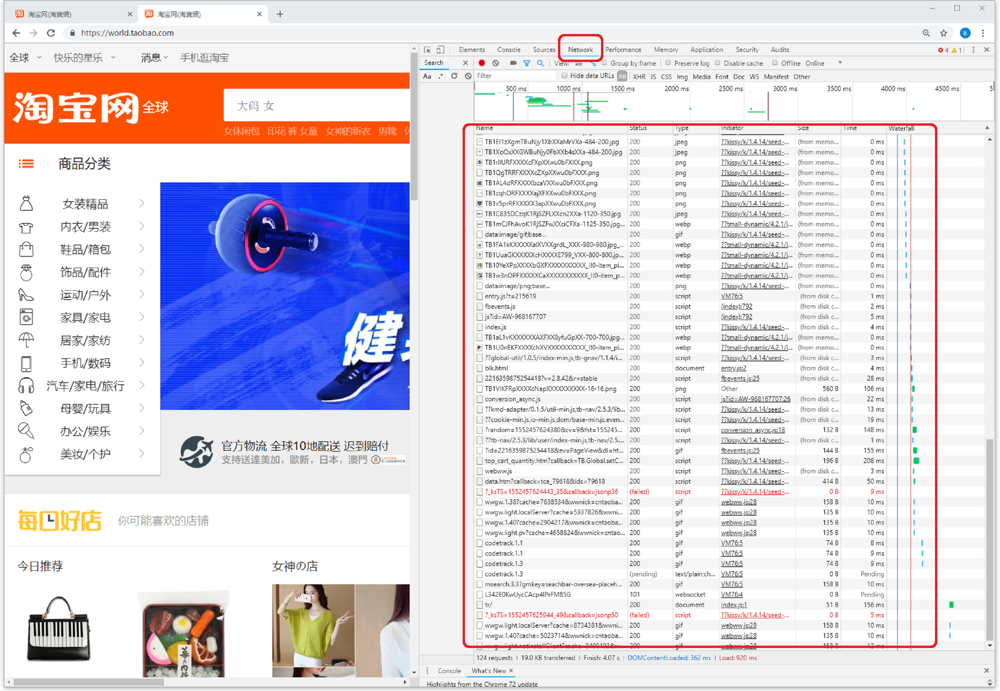
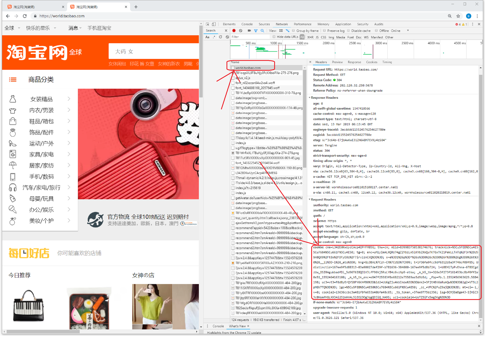

# 1. 介绍 

这是一个爬取淘宝购物记录的爬虫，需要的参数是淘宝的cookie，最后爬取的交易记录以json格式存储。

**注意运行此爬虫爬取数据必须实时获取最新cookie，否则会报错。**


# 2. 如何获取淘宝的cookie
## 2.1 使用chrome浏览器访问www.world.taobao.com并登陆


## 2.2 按下F12，并点击Network查看网络请求

 

​                                                                                                                            

## 2.3 刷新页面并从右边Network网络请求里面找到www.world.taobao.com, 查看这个请求的cookie




# 3. 运行爬虫

将上一步获取到的cookie复制填入python文件，然后运行python即可

```python
if __name__ == '__main__':
    # input your own cookie
    cookie = ""
    user_action = get_user_action(cookie)
    p = open('user_action.json', 'w+')
    p.seek(0)
    p.write(user_action)
    p.close()
```

